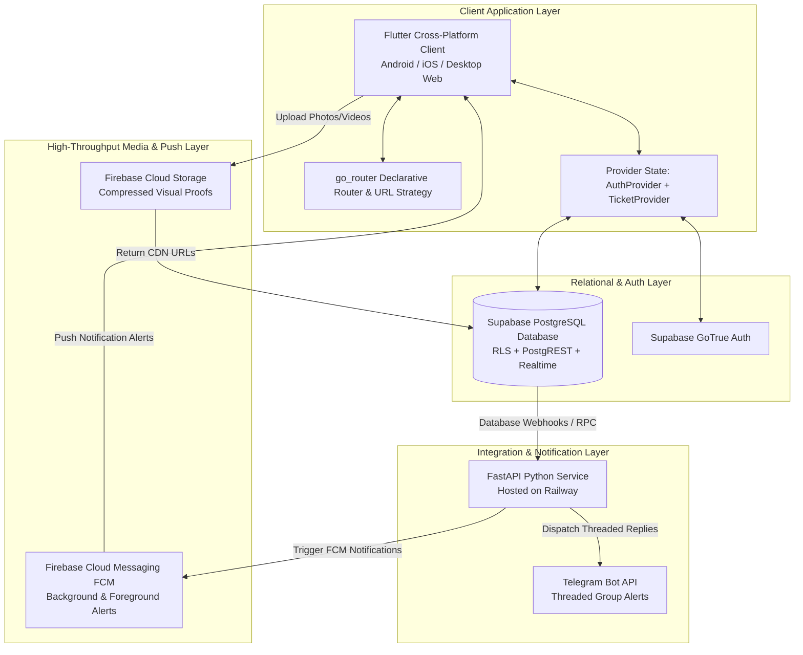
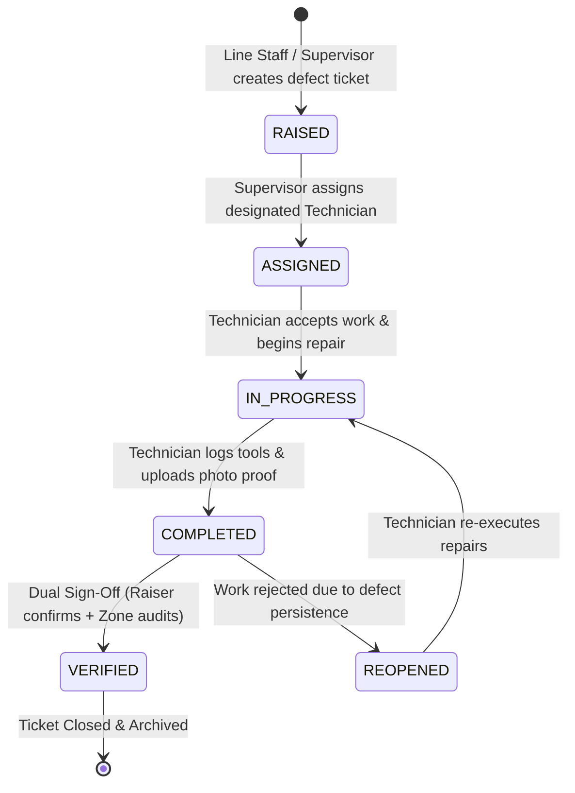
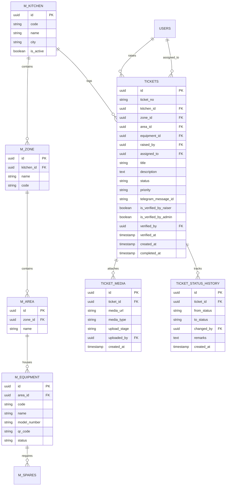

# Product Requirements Document (PRD)

# The Akshaya Patra Foundation (TAPF) — Kitchen Maintenance System

**Document Version:** 2.2.5  
**Last Updated:** September 2026  
**Status:** In Production / Active Evolution  
**Target Platforms:** Android, iOS, Desktop/Web  
**Primary Stakeholders:** Kitchen Operations, Plant Maintenance Engineers, Floor Technicians, Zone Supervisors, Central Maintenance Directors  

---

## Executive Summary & Background

The Akshaya Patra Foundation (TAPF) operates some of the world's largest automated and centralized mega-kitchens, preparing nutritious mid-day meals for millions of school children every school day. These kitchens operate under strict time windows, demanding near-zero downtime for critical industrial plant equipment—including steam boilers, industrial kettles, vegetable processing machinery, reverse osmosis (RO) plants, diesel generator (DG) backups, high-voltage electrical substations, and automated conveyor networks.

Historically, equipment breakdown reporting, maintenance task allocations, and shift utility loggings were handled through manual paper checklists and uncoordinated instant messaging groups (WhatsApp/Telegram). This led to:
- Extended Mean Time to Detect (MTTD) and Mean Time to Repair (MTTR).
- Lack of accountability during task handoffs and verification closures.
- Disconnected photo proofs and lost maintenance histories.
- Fragmented compliance logs for statutory plant audits (boilers, electrical, water quality).

The **TAPF Kitchen Maintenance System** is an enterprise-grade, cross-platform mobile and web application engineered to digitize, streamline, and govern the complete maintenance lifecycle across all TAPF kitchen facilities nationwide.

---

## 1. Product Vision & Strategic Objectives

### 1.1 Vision Statement
To establish a zero-downtime, fully accountable, and auditable maintenance ecosystem across all Akshaya Patra mega-kitchens through real-time defect tracking, automated communication pipelines, and verifiable preventive maintenance.

### 1.2 Core Business Objectives (KPIs & OKRs)
| Objective | Key Result / Metric | Target |
|---|---|---|
| **Minimize Equipment Downtime** | Mean Time to Repair (MTTR) on Critical/High priority breakdowns | $\le 45\text{ minutes}$ for High, $\le 20\text{ minutes}$ for Critical |
| **Enforce Quality & Accountability** | Ratio of closed tickets with verified visual proof & zone sign-off | $100\%$ zero-exception verification |
| **Preventive Maintenance Adherence** | Completion percentage of scheduled PM tasks across major machinery | $\ge 98\%$ on-time adherence |
| **Transparent Operations** | Real-time incident alert dispatch to operational Telegram channels | $< 3\text{ seconds}$ from state transition |
| **Audit & Statutory Readiness** | Digitized daily plant shift utility logs (Boiler, DG, RO, Electrical) | $100\%$ paperless, tamper-evident audit records |

---

## 2. User Personas & Role-Based Access Control (RBAC)

The system supports four distinct operational personas across handheld mobile and desktop workstations:

```
                          ┌───────────────────────────┐
                          │ Central Maintenance Admin │ (Full System / Multi-Kitchen)
                          └─────────────┬─────────────┘
                                        │
                         ┌──────────────┴──────────────┐
                         ▼                             ▼
              ┌─────────────────────┐       ┌──────────────────────┐
              │   Zone Supervisor   │       │  Floor Staff/Raiser  │
              │  (Domain Sign-Off)  │       │  (Defect Reporting)  │
              └──────────┬──────────┘       └──────────┬───────────┘
                         │                             │
                         └──────────────┬──────────────┘
                                        ▼
                          ┌───────────────────────────┐
                          │  Maintenance Technician   │ (Field Repair & Proof)
                          └───────────────────────────┘
```

### 2.1 Persona Specifications

1. **Kitchen Floor Staff / Ticket Raiser:**
   - *Role:* Line supervisors, cook captains, and section in-charges.
   - *Device:* Mid-range Android smartphones.
   - *Goals:* Instantly report equipment faults with photo/video proof; receive alerts when repairs finish; inspect and verify fix satisfaction.
2. **Maintenance Technician:**
   - *Role:* Specialized mechanical, electrical, and plumbing repair personnel.
   - *Device:* Rugged/mid-range Android smartphones.
   - *Goals:* View tasks assigned to their kitchen; transition work orders to In Progress; log spare parts/tools utilized; capture mandatory completion proof images.
3. **Zone Supervisor / Plant Engineer:**
   - *Role:* Responsible for specific operational zones (e.g., Pre-Processing, Cooking, Boiler House, Packaging).
   - *Device:* Tablets and desktop web browsers.
   - *Goals:* Review raised defects; assign technicians; perform technical audit and zone sign-off on completed tickets.
4. **Central Kitchen Admin / Director:**
   - *Role:* Facility Maintenance Head and National Operations Directors.
   - *Device:* Desktop web browsers (widescreen 1080p+).
   - *Goals:* Complete governance across all kitchen locations; approve new user accounts; manage facility hierarchies, spares, and equipment masters; inspect plant uptime analytics.

### 2.2 Granular Permissions Matrix

| Functional Module / Action | Floor Staff / Raiser | Technician | Zone Supervisor | Central Admin |
|---|:---:|:---:|:---:|:---:|
| **Raise Breakdown Ticket** | ✅ | ✅ | ✅ | ✅ |
| **View Tickets (Assigned Kitchens)** | ✅ (Raised by self) | ✅ | ✅ | ✅ |
| **Transition: In Progress / WIP** | ❌ | ✅ | ✅ | ✅ |
| **Transition: Completed (+ Proof Media)** | ❌ | ✅ | ✅ | ✅ |
| **Raiser Satisfaction Verification** | ✅ (If creator) | ❌ | ✅ (If creator) | ✅ |
| **Zone Supervisor Sign-Off** | ❌ | ❌ | ✅ (Assigned zones) | ✅ (All zones) |
| **Reopen Unsatisfactory Ticket** | ✅ | ❌ | ✅ | ✅ |
| **Master Data Management (Zones, Equipment, Spares)** | ❌ | ❌ | ❌ | ✅ |
| **User Account Approval & Kitchen Allocation** | ❌ | ❌ | ❌ | ✅ |
| **Plant Utility Logging (Boiler, DG, RO, Electrical)** | ❌ | ✅ | ✅ | ✅ |
| **Preventive Maintenance (PM) Scheduling** | ❌ | ❌ | ✅ | ✅ |

---

## 3. System Architecture & Technology Stack

The solution utilizes a decoupled, modern multi-tier cloud and client architecture optimized for high reliability, offline tolerance, and responsive data density:



### 3.1 Technology Selection Breakdown

- **Frontend Client (Flutter & Dart 3.x):**
  - Single cross-platform codebase targeting Android APKs, iOS bundles, and responsive Desktop Web.
  - Material Design 3 design system adhering to the official Akshaya Patra brand palette (`#1E3A8A`, `#26538D`, `#F59E0B`).
  - Google Fonts (`Inter`) for crisp typographic hierarchy.
- **Relational Data & Auth (Supabase):**
  - PostgreSQL backing all primary business entities with foreign key constraints and transactional integrity.
  - Row Level Security (RLS) guaranteeing multi-tenant kitchen isolation.
  - Real-time event streams for immediate dashboard metric recalculations.
- **Media Pipeline (Firebase Cloud Storage):**
  - Client-side image compression prior to streaming to resilient cloud buckets.
  - Decoupled media storage prevents high-resolution media payloads from impacting database throughput.
- **Push Notification Services (Firebase Cloud Messaging):**
  - Instant background and terminated-state dispatch to Android/iOS technicians.
- **Operations Notification Broker (FastAPI + Telegram Bot API):**
  - Lightweight Python microservice deployed on Railway.
  - Threaded conversational message chains on Telegram tied to `telegram_message_id`.
- **Navigation & Routing (`go_router` v17.x):**
  - Clean URL strategy (`usePathUrlStrategy`) without `#` hash fragments.
  - Parameterized deep-links (`/tickets/:id`, `/verification`, `/master/*`).
  - Reactive auth-listening redirect guards (`refreshListenable`).

---

## 4. End-to-End Functional Requirements

### 4.1 Module 1: Authentication, Onboarding & User Governance
- **Self-Service Registration:** New staff register with Name, Email, Password, Phone Number, APM ID, and Primary Kitchen.
- **Pending Approval Gatekeeper:** Upon registration, user accounts are placed in `PENDING` state. Access is guarded by `PendingApprovalScreen`.
- **Admin Approval Workflow:**
  - Designated central administrators receive in-app and Telegram notifications for new account requests.
  - Admins review and allocate permitted kitchens and assigned zones in `UserManagementScreen`.
  - Upon approval, the backend automatically issues a FCM `USER_APPROVED` silent data push; the user's active client refreshes credentials and navigates directly to the Home dashboard without app restart.
- **Multi-Kitchen Switching:** Users allocated to multiple kitchens can seamlessly toggle active operational context via an AppBar dropdown selector, synchronizing all ticket queues, equipment lists, and area filters.

---

### 4.2 Module 2: Ticket Lifecycle & Workflow Engine

The ticket management engine governs the core operational workflow:



#### Lifecycle Step Specifications

1. **Ticket Raising (`RAISED`):**
   - *Inputs:* Title, Detailed Description, Kitchen ID, Zone ID, Area ID, Equipment ID, Priority Level (`CRITICAL`, `HIGH`, `MEDIUM`, `LOW`), Break-down Category, Initial Defect Photos/Videos.
   - *System Actions:* Generates unique Ticket Number (e.g. `TK-2026-0042`); creates record in `tickets` table; uploads media to Firebase; dispatches initial Telegram alert and captures `telegram_message_id`.
2. **Technician Assignment (`ASSIGNED`):**
   - *Inputs:* Assignee ID (Technician).
   - *System Actions:* Sends targeted FCM push alert to the technician's mobile device; posts threaded update on Telegram.
3. **Work In Progress (`IN_PROGRESS`):**
   - *Inputs:* Start timestamp, initial diagnostic remarks.
   - *System Actions:* Updates ticket status; updates Telegram thread.
4. **Repair Completion (`COMPLETED`):**
   - *Inputs:* Resolution summary, Root cause classification, Spares replaced, Tools & Tackles used, Mandatory "After-Repair" completion photo/video.
   - *System Actions:* Enforces validation checks ensuring completion photo is present; tags media record with `upload_stage = 'COMPLETED'`; triggers pending verification counter increments; alerts raiser and zone supervisor.
5. **Dual-Tier Verification (`VERIFIED`):**
   - *Sign-Off 1: Raiser Satisfaction (`is_verified_by_raiser = true`)* confirms the machine functions properly during production.
   - *Sign-Off 2: Zone Supervisor Sign-Off (`is_verified_by_admin = true`)* audits technical adherence, safety standards, and spare parts accuracy.
   - *System Actions:* When both sign-offs are satisfied, status transitions to `VERIFIED`; records `verified_by` and `verified_at`; posts final threaded closure alert to Telegram.
6. **Reopening (`REOPENED`):**
   - *Inputs:* Rejection remarks explaining why repair failed.
   - *System Actions:* Status reverts to `IN_PROGRESS` or `ASSIGNED`; notifies technician immediately.

---

### 4.3 Module 3: Ticket Verification Engine & Desktop Data Grid

To enable fast, error-free auditing across dozens of daily work orders, the verification module provides a responsive hybrid layout:

- **Desktop Web Experience (`width > 800px`):**
  - **75px TAPF Header:** Displays official corporate mark, facility switcher, real-time interactive metric cards ("Total Pending", "Raised by Me", "Zone Sign-Off"), and asynchronous refresh controls.
  - **Interactive 9-Column Verification Grid:**
    1. *Ticket #*: Clickable ID badge routing to full ticket detail view.
    2. *Title & Problem Statement*: Defect summary and machine identity.
    3. *Zone & Area*: Color-coded operational zone hierarchy.
    4. *Priority*: Colored indicator with SLA level.
    5. *Assigned Tech*: Personnel name with completion timestamp.
    6. *Proof Media*: In-line 44x44 thumbnail of the actual repair proof photo with zoom badge.
    7. *Resolution Info*: Technical action taken and root cause summary.
    8. *Audit Status*: Dual visual status pills for Raiser and Zone approvals.
    9. *Action*: Direct inline "Verify" / "Sign-Off" button opening confirmation dialog.
  - **In-Line Lightbox Inspection:** Clicking any proof photo opens an `InteractiveViewer` modal supporting pinch-to-zoom, pan, and 0.5x–4.0x zoom boundaries without navigating away from the review queue.
- **Mobile Card Experience (`width <= 800px`):**
  - Touch-optimized card list segmented by "Raised by Me" and "Zone Sign-Off" tabs.
  - Embedded 54x54 completion photo thumbnails with tap-to-expand lightbox.

---

### 4.4 Module 4: UI/UX Motion & Query Concurrency Engine

To prevent UI jitter, race conditions, and abrupt list snapping:
- **Dynamic Position-Swapping Animation:** When users change search queries, priority filters, or sort orders, tickets smoothly glide to their new slots using `_AnimatedTicketCard` (mobile) and `_AnimatedTableRow` (web) over `650ms` (`Curves.easeOutCubic`).
- **Tactile Elevation Lift:** Moving items subtly scale up (`+2.5%` mobile, `+1.5%` web) during transit to visually float above adjacent elements.
- **Asynchronous Request ID Concurrency Guard:** An incrementing `_fetchRequestId` drops stale asynchronous database responses if subsequent filter interactions were triggered while earlier queries were in-flight.
- **Atomic Filter Reset:** `resetAllFilters()` clears all dimensions synchronously before initiating a single authoritative fetch.

---

### 4.5 Module 5: Multi-Channel Real-Time Notifications

```
   ┌─────────────────────────────────────────────────────────────┐
   │                    State Change Event                       │
   │           (e.g., Ticket Raised / Completed / Verified)      │
   └──────────────┬───────────────────────────────┬──────────────┘
                  │                               │
                  ▼                               ▼
     ┌────────────────────────┐      ┌─────────────────────────┐
     │  Firebase FCM Engine   │      │  Railway Python Service │
     └────────────┬───────────┘      └────────────┬────────────┘
                  │                               │
                  ▼                               ▼
       Mobile Push Notification            Telegram Group
       - Interactive Banners               - Threaded Message
       - Deep Link to /tickets/:id         - reply_to_message_id
```

1. **Foreground In-App Banners:** High-contrast notification snackbars appear in the active Flutter context with an instant "VIEW" shortcut and auto-dismiss timer.
2. **Mobile Push (FCM):** Background and terminated-state notifications route the device directly to the relevant ticket detail view via `context.push(AppRoutes.ticketDetailPath(ticketId))`.
3. **Threaded Telegram Operation Channels:**
   - On ticket creation, the initial alert records `telegram_message_id`.
   - All subsequent status transitions (WIP, completion photos, verification sign-offs) are posted as threaded replies directly attached to the root ticket message, eliminating disconnected message clutter.

---

### 4.6 Module 6: Facility Master Data Management

Accessible to Central Administrators via the `MoreScreen` drawer:
- **Kitchen Master (`/master/kitchen`):** Facility code, geographic location, operational capacity, active state.
- **Zone Master (`/master/zone`):** Operational plant division (e.g. Pre-Processing, Steam Cooking, Bakery, Utensil Cleaning, Utilities).
- **Area Master (`/master/area`):** Granular sub-zones linked hierarchically to zones.
- **Equipment Master (`/master/equipment`):** Asset serial numbers, machine models, installation dates, QR code identifiers, critical spares mapping, warranty expiry.
- **Spares & Inventory (`/master/spares`, `/master/spares/inventory`):** Catalog of mechanical/electrical spares, current stock levels, reorder minimum thresholds, unit costs.
- **Tools & Tackles (`/master/tools`):** Calibration tracking, maintenance tool inventories.
- **Vendor Master (`/master/vendors`):** Approved original equipment manufacturers (OEMs), third-party service contractors, emergency contact hotlines.

---

### 4.7 Module 7: Plant Utility Logging & Statutory Reports

Mega-kitchens must maintain legal and operational compliance logs across specialized plant utilities:
- **Boiler Daily Shift Log (`/reports/boiler-log`):** Steam pressure (bar), fuel level, feed water TDS, blowdown frequency, safety valve test logs.
- **Diesel Generator (DG) Log (`/reports/dg-log`):** Run hours, fuel consumption, battery voltage, oil temperature, energy output (kVA).
- **RO Plant Water Checklist (`/reports/ro-checklist`):** Raw water TDS, permeate TDS, pH level, differential membrane pressures, chemical dosing levels.
- **Electrical Substation Log (`/reports/electrical-log`):** Transformer temperatures, power factor, peak load current, capacitor bank status.
- **Preventive Maintenance (PM) Engine (`/reports/pm-schedule`, `/reports/pm-checklist`):** Scheduled recurring servicing checklists for plant machinery (daily, weekly, monthly, quarterly).
- **Breakdown & Incident Reports (`/reports/breakdown`):** Root cause failure analysis (RCFA), machine downtime history, component lifespan auditing.

---

### 4.8 Module 8: Version Control & Remote App Update Enforcement

To guarantee zero database schema mismatch errors in field environments:
- **`AppUpdateWrapper`:** Roots the Flutter widget hierarchy in `MaterialApp.router`.
- **Remote Version Check:** Compares local client version/build against `m_app_versions` or Firebase Remote Config:
  - *Hard Block (Force Update):* If installed version < minimum supported version, renders an immovable `AppUpdateScreen` offering direct APK download links.
  - *Soft Update Banner:* If installed version < latest version, displays a dismissible reminder banner.

---

## 5. Non-Functional Requirements (NFRs)

### 5.1 Performance & Latency
- **UI Frame Rate:** Constant 60 FPS rendering on target Android devices during list scrolling and animated state-swapping transitions.
- **Query Response Time:** Ticket search and dashboard counter calculations execute in $\le 500\text{ ms}$ over 4G connections.
- **Optimistic State Feedback:** Status updates render instantly in the UI with asynchronous sync confirmation.
- **Image Optimization:** Automated client-side image compression reducing 10MB+ camera captures to $\le 350\text{ KB}$ before network upload.

### 5.2 Reliability & Availability
- **High Availability:** Supabase multi-zone PostgreSQL database uptime SLA $\ge 99.9\%$.
- **CDN Media Delivery:** Firebase Storage global edge caching ensuring fast thumbnail rendering on low-bandwidth kitchen WiFi networks.
- **Graceful Error Handling:** Automated network retry with exponential backoff on all critical API and notification payloads.

### 5.3 Security & Data Protection
- **Row Level Security (RLS):** Strict PostgreSQL database-level security policies restricting user read/write access exclusively to authorized kitchen scopes.
- **Encrypted In-Transit & At-Rest:** TLS 1.3 enforced for all client-server communication; AES-256 encryption at rest for cloud databases and media storage.
- **Authentication Token Lifecycle:** Secure JWT token storage using platform-specific keystores (`SharedPreferences` on Android, `Keychain` on iOS).

### 5.4 Cross-Platform Responsive Form Factors
- **Mobile Viewport ($\le 800\text{px}$):** Vertical card architecture, sliver-driven scroll views, pull-to-refresh gestures, touch-friendly tap targets ($\ge 48\times 48\text{dp}$).
- **Desktop/Web Viewport ($> 800\text{px}$):** High-density data tables, fixed sticky headers, horizontal KPI cards, inline action controls, keyboard shortcuts.

---

## 6. Entity Relationship & Data Model (Core Tables)



---

## 7. Product Release Roadmap

### Phase 1: Foundation & Core Workflows (Completed)
- ✅ Flutter cross-platform architecture with Supabase backend and Firebase Storage.
- ✅ Full ticket lifecycle (`RAISED` $\to$ `ASSIGNED` $\to$ `IN PROGRESS` $\to$ `COMPLETED` $\to$ `VERIFIED`).
- ✅ Real-time Telegram bot alerts with threaded conversation replies.
- ✅ Declarative URL routing with `go_router` and reactive auth guards.
- ✅ Desktop Web data grid for ticket verification with in-line image lightbox inspection.
- ✅ Concurrency guards and animated physical position-swapping.

### Phase 2: Operational Intelligence & Automation (Near-Term)
- 🔄 **Equipment QR Code Scanning:** Physical QR badges affixed to kitchen machinery allowing instant ticket raising by pointing the mobile camera.
- 🔄 **Offline-First Synchronization Queue:** Local SQLite/Hive storage caching ticket updates created in basement/utility zones with poor signal, auto-syncing upon reconnection.
- 🔄 **Automated Preventive Maintenance (PM) Work Orders:** Automated cron dispatch converting recurring PM schedule templates into actionable technician tickets.

### Phase 3: Predictive Maintenance & Enterprise ERP (Long-Term)
- 🔮 **IoT Sensor Telemetry Integration:** Vibration, acoustic, and thermal sensors on steam boilers and main pumps triggering automated threshold breakdown warnings.
- 🔮 **Automated Spare Part Requisitions:** Integration with central procurement and ERP systems (SAP/Oracle) when spare parts stock falls below critical thresholds.
- 🔮 **Multi-Language Regional Localization:** Indian vernacular language support (Hindi, Kannada, Gujarati, Odia, Telugu, Tamil) tailored for diverse kitchen staff across nationwide locations.

---

## 8. Acceptance Criteria & Sign-Off Checklist

A release candidate is deemed production-ready only when satisfying the following quality standards:

1. **Zero-Defect Navigation:** Deep-links (`/tickets/:id`, `/verification`, `/master/equipment`) load accurately upon direct URL entry or browser refresh without authentication desynchronization.
2. **Mandatory Proof Gating:** A technician cannot submit a ticket as `COMPLETED` without uploading at least one photo under `upload_stage = 'COMPLETED'`.
3. **Zone Authority Adherence:** A supervisor assigned exclusively to Zone A (e.g. Cooking) is strictly prohibited from signing off on tickets belonging to Zone B (e.g. Boiler House).
4. **Threaded Alert Integrity:** Telegram notifications for status updates (`IN_PROGRESS`, `COMPLETED`, `VERIFIED`) must reference the original `telegram_message_id` as a direct reply.
5. **No Visual Overflows:** Zero `RenderFlex` overflow warnings across all supported mobile resolutions ($360\text{dp}\dots 480\text{dp}$) and desktop displays ($1080\text{p}\dots 4\text{K}$).
6. **Version Guard Operation:** Modifying minimum supported version in remote configuration immediately triggers the hard-block force update screen on obsolete client builds.
