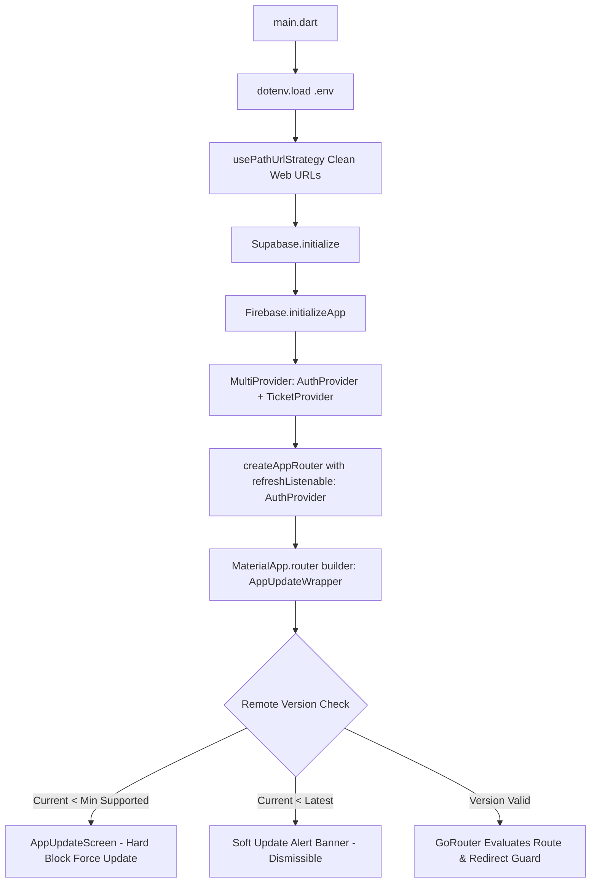
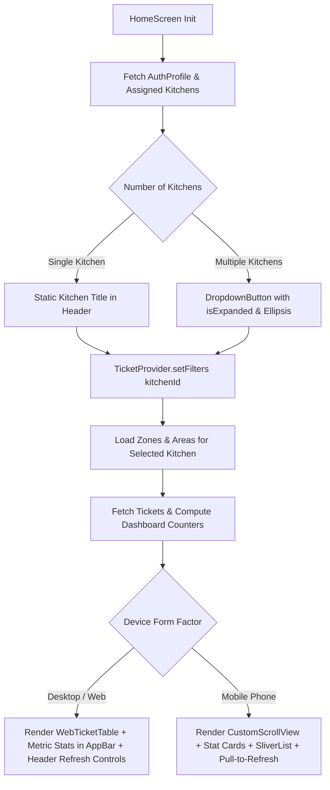
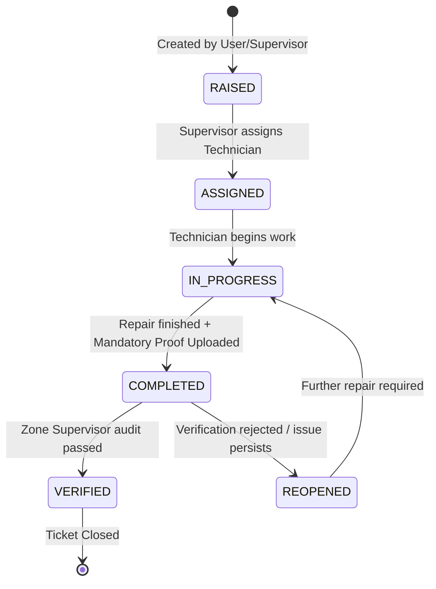
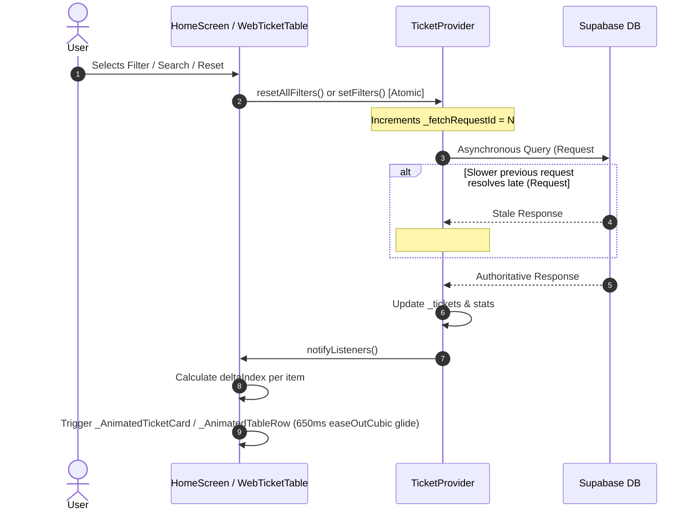
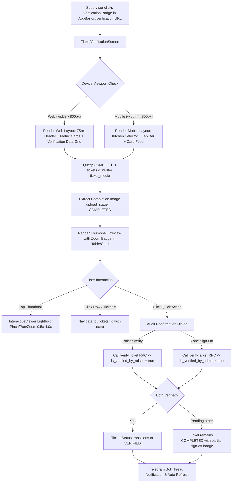
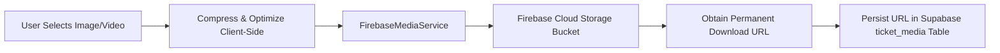
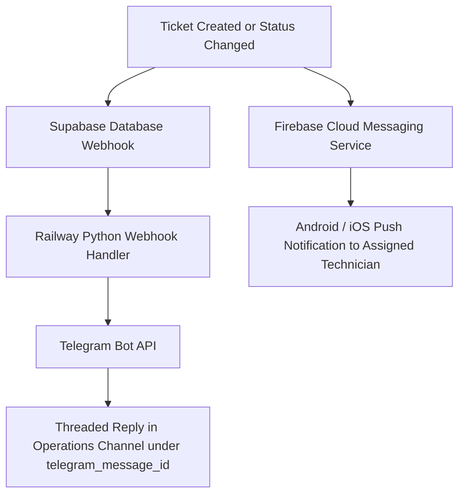

# Application Flow & Architecture Map - Kitchen Maintenance

This document provides a comprehensive end-to-end breakdown of the user flows, data lifecycles, and architectural component interactions for the **The Akshaya Patra Foundation (TAPF) Kitchen Maintenance System**.

---

## Table of Contents
1. [App Initialization & Remote Version Enforcement](#1-app-initialization--remote-version-enforcement)
2. [Authentication & Authorization State Machine](#2-authentication--authorization-state-machine)
3. [Main Workspace & Kitchen Switching Flow](#3-main-workspace--kitchen-switching-flow)
4. [Ticket Lifecycle & State Transitions](#4-ticket-lifecycle--state-transitions)
5. [Search, Filter, Sorting & Concurrency Sequencing](#5-search-filter-sorting--concurrency-sequencing)
6. [Ticket Verification Flow (Zone-Based)](#6-ticket-verification-flow-zone-based)
7. [Media Upload & Storage Pipeline](#7-media-upload--storage-pipeline)
8. [External Integrations & Push Notifications](#8-external-integrations--push-notifications)
9. [Master Data & Plant Maintenance Modules](#9-master-data--plant-maintenance-modules)

---

## 1. App Initialization, Declarative Routing & Remote Version Enforcement

Every app launch executes a synchronous bootstrap sequence wrapped with version enforcement and declarative URL routing:



- **Entry Point**: [`lib/main.dart`](file:///Users/harsh/Documents/TAPF%20Projects/flutter%20projects/kitchen_maintanence/lib/main.dart)
- **Router Configuration**: [`lib/core/routes/app_router.dart`](file:///Users/harsh/Documents/TAPF%20Projects/flutter%20projects/kitchen_maintanence/lib/core/routes/app_router.dart)
- **Route Constants**: [`lib/core/routes/app_routes.dart`](file:///Users/harsh/Documents/TAPF%20Projects/flutter%20projects/kitchen_maintanence/lib/core/routes/app_routes.dart)
- **Version Guard**: [`AppUpdateWrapper`](file:///Users/harsh/Documents/TAPF%20Projects/flutter%20projects/kitchen_maintanence/lib/screens/updates/app_update_wrapper.dart) reads version boundaries from remote configuration (`m_app_versions` or Firebase Remote Config).

### Canonical URL Route Map

| Path | Screen / View | Role / Guard Requirements |
|---|---|---|
| `/splash` | `_SplashScreen` | Internal: Shown while `authProvider.isInitializing` |
| `/login` | `LoginScreen` | Public: Authenticates via Supabase |
| `/register` | `RegisterScreen` | Public: New user onboarding |
| `/pending-approval` | `PendingApprovalScreen` | Guarded: Users where `isApproved == false` |
| `/` | `HomeScreen` | Authenticated: Main ticket dashboard & tabs |
| `/tickets/new` | `CreateTicketScreen` | Authenticated: Issue raising |
| `/tickets/:id` | `TicketDetailScreen` | Authenticated: Deep-linkable ticket details |
| `/verification` | `TicketVerificationScreen` | Authenticated (Supervisor/Admin) |
| `/master/area` | `AreaMasterScreen` | Authenticated (Admin) |
| `/master/zone` | `ZoneMasterScreen` | Authenticated (Admin) |
| `/master/equipment` | `EquipmentMasterScreen` | Authenticated (Admin) |
| `/master/spares` | `SparesMasterScreen` | Authenticated (Admin) |
| `/master/spares/inventory` | `SpareInventoryScreen` | Authenticated (Admin) |
| `/master/tools` | `ToolsMasterScreen` | Authenticated (Admin) |
| `/master/vendors` | `VendorMasterScreen` | Authenticated (Admin) |
| `/master/users` | `UserManagementScreen` | Authenticated (Admin) |
| `/reports` | `ReportsScreen` | Authenticated (Supervisor/Admin) |
| `/reports/*` | Utility & Maintenance Log Screens | Authenticated (Guarded per report code) |

---

## 2. Authentication & Authorization State Machine (Reactive Navigation Guards)

User sessions transition through deterministic states managed by [`AuthProvider`](file:///Users/harsh/Documents/TAPF%20Projects/flutter%20projects/kitchen_maintanence/lib/providers/auth_provider.dart). The router acts as a listener on `AuthProvider` via `refreshListenable`, reactively re-evaluating the current route upon state change:

```mermaid
stateDiagram-v2
    [*] --> Initializing: App Boot
    Initializing --> /splash: authProvider.isInitializing == true
    
    Initializing --> Unauthenticated: No Active Session
    Unauthenticated --> /login: Redirect Guard forces /login
    
    /login --> FetchProfile: Successful Auth Credentials
    FetchProfile --> /pending-approval: User profile status == PENDING
    /pending-approval --> /login: User logs out
    
    FetchProfile --> /: User profile status == ACTIVE
    / --> /tickets/:id: User clicks ticket card / Deep link
    / --> /verification: Supervisor clicks verification badge
    / --> /master/*: Admin navigates via More Screen
    / --> /reports/*: Supervisor navigates via Reports
    / --> /login: User logs out -> Guard bounces to /login
```

### Roles & Access Scopes
- **Technician**: Can view tickets for assigned kitchens, change status to `IN_PROGRESS` / `COMPLETED`, attach tools and proof media.
- **Supervisor**: Can create tickets, assign technicians, approve/verify completed tickets for supervised zones.
- **Admin**: Full authority across all kitchens, user approvals, master data, and analytics.

---

## 3. Main Workspace & Kitchen Switching Flow

Upon reaching `HomeScreen`, the app determines the device viewport (`isWeb` vs. mobile) and binds to the active kitchen:



### Data Refresh Capabilities
- **Web / Desktop**: Dedicated AppBar refresh icon button, table header column refresh button, and empty-state "Refresh Data" action trigger `ticketProvider.refreshTickets()`.
- **Mobile**: Touch-driven `RefreshIndicator` (pull-to-refresh) and AppBar refresh action.


---

## 4. Ticket Lifecycle & State Transitions

Tickets move through strict status gates with dual-verification requirements:



### Mandatory Requirements per Step
1. **Creation**: Title, description, kitchen, zone, area, equipment ID, priority (`CRITICAL`, `HIGH`, `MEDIUM`, `LOW`), initial media.
2. **Completion**: Tools used selection, resolution notes, after-repair photo/video proof.
3. **Verification**: Zone supervisor sign-off (`is_verified = true`, `verified_by`, `verified_at`).

---

## 5. Search, Filter, Sorting & Concurrency Sequencing

To guarantee fluid 60fps UX without race conditions:



- **Delta Tracking**: Relative offset glide `deltaIndex * 122.0` (mobile) or `deltaIndex * 48.0` (web).
- **Scale Elevation Lift**: Items in motion scale up `+2.5%` (mobile) or `+1.5%` (web).
- **Staggered Fade-in**: New items entrance from `+20px` / `+16px` with opacity ramp `0.2 -> 1.0`.

---

## 6. Ticket Verification Flow & Dual-Auditor Lifecycle

Completed tickets require sign-off before closure. Depending on role and allocation, users verify in two independent or concurrent capacities:
1. **Raiser Verification**: The original creator of the ticket confirms that the reported defect has been resolved satisfactorily.
2. **Zone Sign-Off**: The allocated Zone Leader or central Administrator audits the work, checks adherence to standards, and approves closure.



### Desktop Web Layout Columns
| Column | Description |
|---|---|
| **Ticket #** | Unique ID badge with click-to-open routing. |
| **Title & Description** | Defect title, asset icon & name, and problem statement. |
| **Zone & Area** | Colored zone badge with specific area hierarchy. |
| **Priority** | Priority indicator dot and color-coded text (`CRITICAL`, `HIGH`, `MEDIUM`, `LOW`). |
| **Assigned Tech** | Technician name with completion timestamp. |
| **Proof Media** | In-line 44x44 completion photo thumbnail with click-to-enlarge lightbox. |
| **Resolution Info** | Technician's action taken and cause remarks. |
| **Audit Status** | Dual status pills for Raiser and Zone approval. |
| **Action** | Primary quick-action button ("Verify" or "Sign-Off") + detail shortcut. |

---

## 7. Media Upload & Storage Pipeline

All visual proofs and attachments are routed through Firebase Cloud Storage for resilience and CDN distribution:



---

## 8. External Integrations & Push Notifications



---

## 9. Master Data & Plant Maintenance Modules

Accessible via [`MoreScreen`](file:///Users/harsh/Documents/TAPF%20Projects/flutter%20projects/kitchen_maintanence/lib/screens/more_screen.dart):

- **Master Configuration**:
  - `EquipmentMasterScreen`: Equipment categorization, QR code binding, critical spares tagging, zone filtering.
  - `ZoneMasterScreen` & `AreaMasterScreen`: Hierarchical kitchen mapping.
  - `UserManagementScreen`: Supervisor zone assignments and role capabilities.
- **Plant Maintenance Reports & Logs**:
  - `PMScheduleScreen`: Preventive maintenance calendar and task checklists.
  - `ElectricalLogScreen`, `BoilerLogScreen`, `ROChecklistScreen`, `DGLogScreen`: Specialized plant utility daily shift logs.
  - `BreakdownReportScreen` & `CriticalSparesReportScreen`: Operational uptime analysis.
