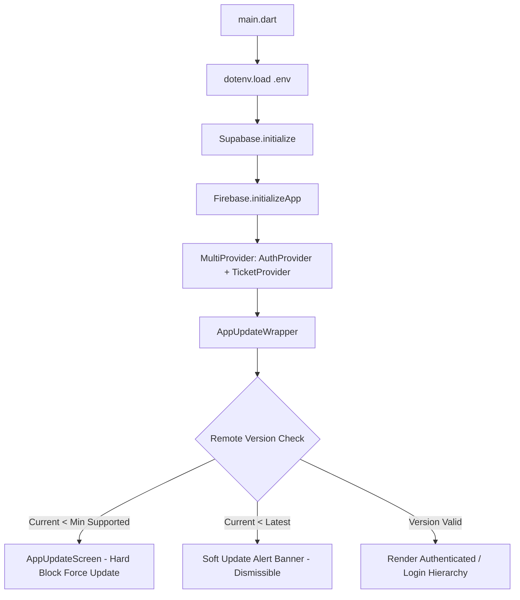
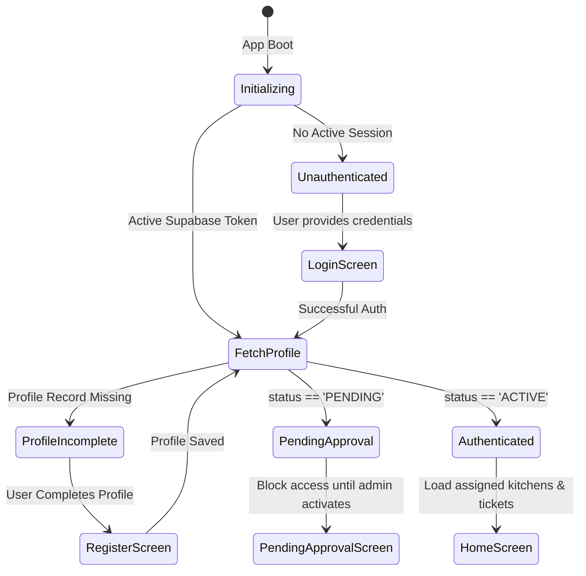
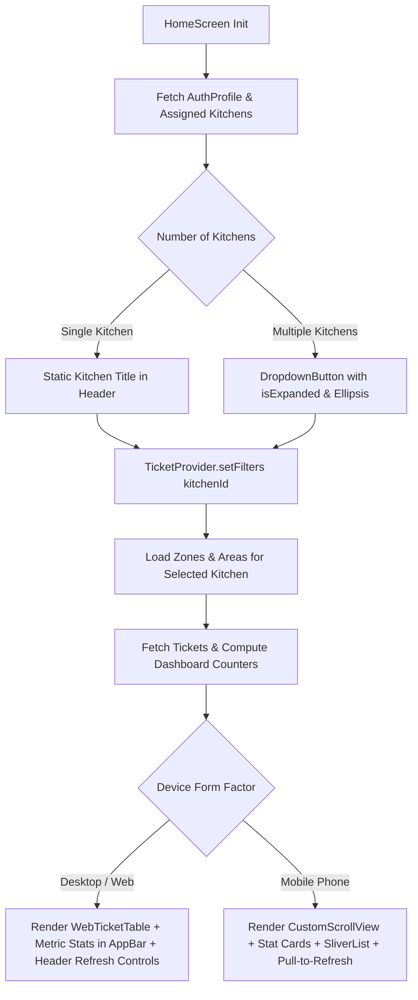
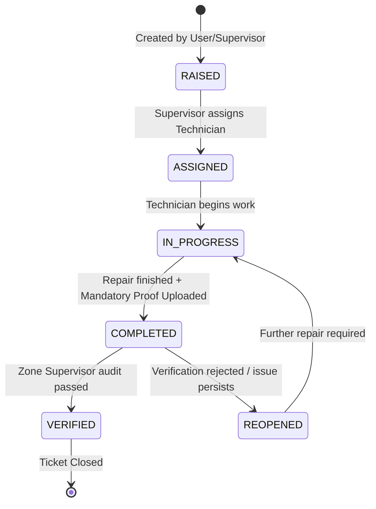
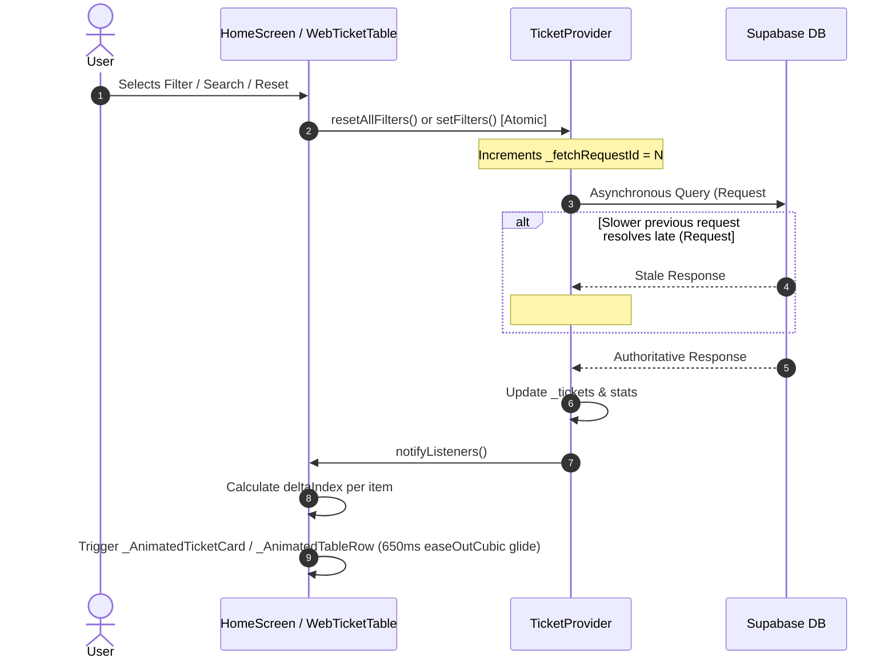
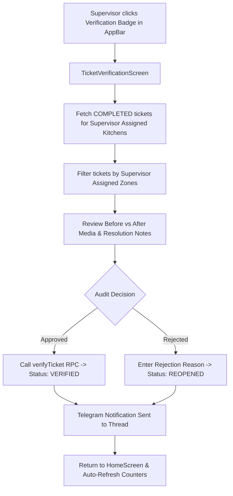
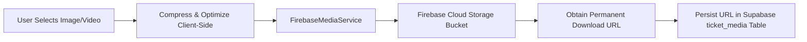
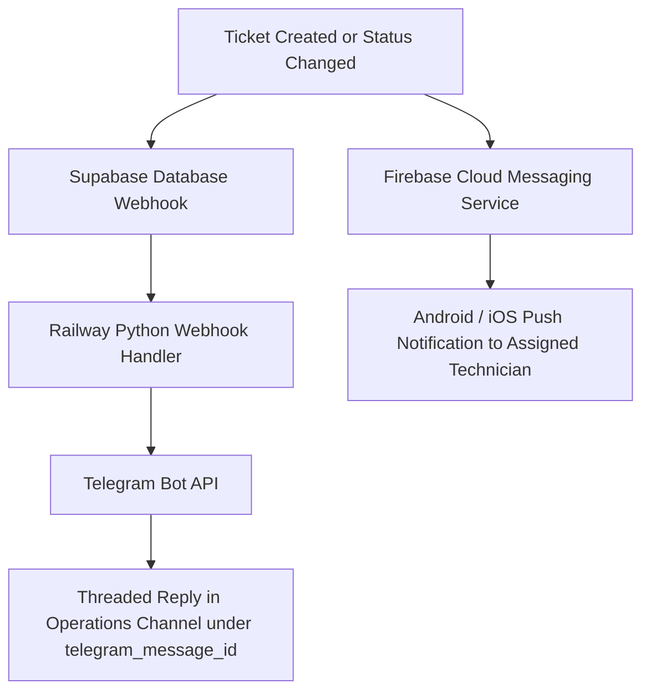

# Application Flow & Architecture Map - Kitchen Maintenance

This document provides a comprehensive end-to-end breakdown of the user flows, data lifecycles, and architectural component interactions for the **The Akshaya Patra Foundation (TAPF) Kitchen Maintenance System**.

---

## Table of Contents
1. [App Initialization & Remote Version Enforcement](#1-app-initialization--remote-version-enforcement)
2. [Authentication & Authorization State Machine](#2-authentication--authorization-state-machine)
3. [Main Workspace & Kitchen Switching Flow](#3-main-workspace--kitchen-switching-flow)
4. [Ticket Lifecycle & State Transitions](#4-ticket-lifecycle--state-transitions)
5. [Search, Filter, Sorting & Concurrency Sequencing](#5-search-filter-sorting--concurrency-sequencing)
6. [Ticket Verification Flow (Zone-Based)](#6-ticket-verification-flow-zone-based)
7. [Media Upload & Storage Pipeline](#7-media-upload--storage-pipeline)
8. [External Integrations & Push Notifications](#8-external-integrations--push-notifications)
9. [Master Data & Plant Maintenance Modules](#9-master-data--plant-maintenance-modules)

---

## 1. App Initialization & Remote Version Enforcement

Every app launch executes a synchronous bootstrap sequence wrapped with version enforcement:

- **Entry Point**: [`lib/main.dart`](file:///Users/harsh/Documents/TAPF%20Projects/flutter%20projects/kitchen_maintanence/lib/main.dart)
- **Version Guard**: [`AppUpdateWrapper`](file:///Users/harsh/Documents/TAPF%20Projects/flutter%20projects/kitchen_maintanence/lib/screens/updates/app_update_wrapper.dart) reads version boundaries from remote configuration (`m_app_versions` or Firebase Remote Config).

---

## 2. Authentication & Authorization State Machine

User sessions transition through four deterministic states managed by [`AuthProvider`](file:///Users/harsh/Documents/TAPF%20Projects/flutter%20projects/kitchen_maintanence/lib/providers/auth_provider.dart):

### Roles & Access Scopes
- **Technician**: Can view tickets for assigned kitchens, change status to `IN_PROGRESS` / `COMPLETED`, attach tools and proof media.
- **Supervisor**: Can create tickets, assign technicians, approve/verify completed tickets for supervised zones.
- **Admin**: Full authority across all kitchens, user approvals, master data, and analytics.

---

## 3. Main Workspace & Kitchen Switching Flow

Upon reaching `HomeScreen`, the app determines the device viewport (`isWeb` vs. mobile) and binds to the active kitchen:

### Data Refresh Capabilities
- **Web / Desktop**: Dedicated AppBar refresh icon button, table header column refresh button, and empty-state "Refresh Data" action trigger `ticketProvider.refreshTickets()`.
- **Mobile**: Touch-driven `RefreshIndicator` (pull-to-refresh) and AppBar refresh action.

---

## 4. Ticket Lifecycle & State Transitions

Tickets move through strict status gates with dual-verification requirements:

### Mandatory Requirements per Step
1. **Creation**: Title, description, kitchen, zone, area, equipment ID, priority (`CRITICAL`, `HIGH`, `MEDIUM`, `LOW`), initial media.
2. **Completion**: Tools used selection, resolution notes, after-repair photo/video proof.
3. **Verification**: Zone supervisor sign-off (`is_verified = true`, `verified_by`, `verified_at`).

---

## 5. Search, Filter, Sorting & Concurrency Sequencing

To guarantee fluid 60fps UX without race conditions:

- **Delta Tracking**: Relative offset glide `deltaIndex * 122.0` (mobile) or `deltaIndex * 48.0` (web).
- **Scale Elevation Lift**: Items in motion scale up `+2.5%` (mobile) or `+1.5%` (web).
- **Staggered Fade-in**: New items entrance from `+20px` / `+16px` with opacity ramp `0.2 -> 1.0`.

---

## 6. Ticket Verification Flow (Zone-Based)

---

## 7. Media Upload & Storage Pipeline

All visual proofs and attachments are routed through Firebase Cloud Storage for resilience and CDN distribution:

---

## 8. External Integrations & Push Notifications

---

## 9. Master Data & Plant Maintenance Modules

Accessible via [`MoreScreen`](file:///Users/harsh/Documents/TAPF%20Projects/flutter%20projects/kitchen_maintanence/lib/screens/more_screen.dart):

- **Master Configuration**:
  - `EquipmentMasterScreen`: Equipment categorization, QR code binding, critical spares tagging, zone filtering.
  - `ZoneMasterScreen` & `AreaMasterScreen`: Hierarchical kitchen mapping.
  - `UserManagementScreen`: Supervisor zone assignments and role capabilities.
- **Plant Maintenance Reports & Logs**:
  - `PMScheduleScreen`: Preventive maintenance calendar and task checklists.
  - `ElectricalLogScreen`, `BoilerLogScreen`, `ROChecklistScreen`, `DGLogScreen`: Specialized plant utility daily shift logs.
  - `BreakdownReportScreen` & `CriticalSparesReportScreen`: Operational uptime analysis.
